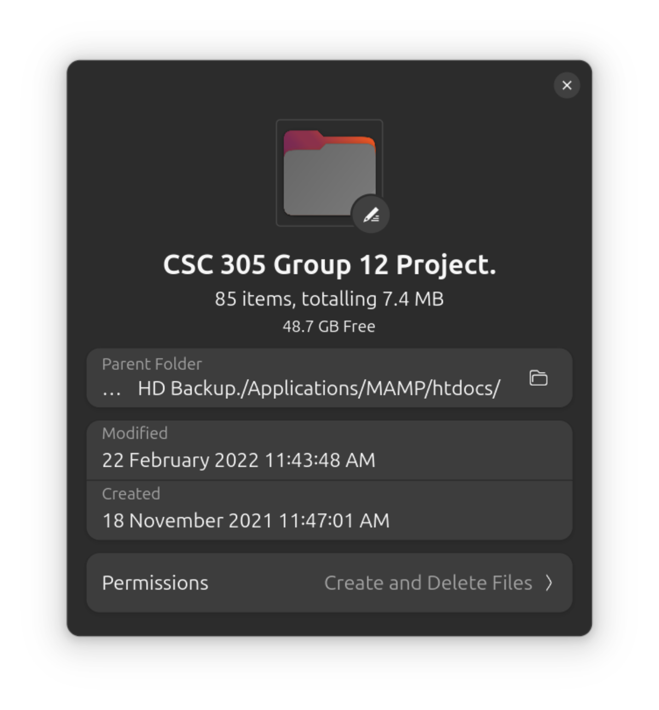

# CSC 305 Group 12 Project

## Project Title: Web-Enabled Thrift/Cooperative Society Management System

## Project Overview

This project was developed as part of the CSC 305 (Web Programming) course during the **3rd year, 1st semester** of my Computer Science program at the **Federal University Oye-Ekiti (FUOYE)**. The task was assigned to a group of **10 members** to collaboratively design and implement a web-based platform for managing thrift/cooperative society operations.

The project aimed to apply practical knowledge of **web programming technologies** to solve a real-world problem in financial and resource management within small cooperative groups or societies.

Created and completed between 18th Nov 2021 and 22nd Feb 2022.

## Project Goals

The primary goals of the project were:

- To develop a functional **web-based system** for managing thrift/cooperative society activities.
- To implement **user authentication** for secure access to the platform.
- To enable features such as **member registration, savings management, loan applications**, and financial records tracking.
- To ensure a simple and intuitive user interface for both administrators and members.
- To demonstrate practical application of **HTML, CSS, JavaScript, PHP**, and **MySQL**.

## Desired Features

1. **User Registration and Login**
   - Secure authentication for members and administrators.
2. **Member Dashboard**
   - Overview of individual savings and loan status.
3. **Admin Dashboard**
   - Management of member records, financial contributions, and loan applications.
4. **Savings Contribution Tracking**
   - Members can view their contributions and total savings.
5. **Loan Management System**
   - Request and approval system for loans with records stored in a database.
6. **Responsive Design**
   - Ensured basic accessibility and usability on both desktop and mobile devices.

## Technologies Used

- **Frontend**: HTML5, CSS3, JavaScript
- **Backend**: PHP
- **Database**: MySQL
- **Local Server**: MAMP

## Screenshots

Here's a screenshots of the project folder properties:

## Lessons Learned

Through this project, I gained hands-on experience with:

- Designing and structuring **web applications**.
- Backend development using **PHP** and database integration with **MySQL**.
- Effective group collaboration and task delegation.
- Debugging and troubleshooting **common web development errors**.

## License

This project ordinarily shouldn't be needing a license, but if for any reason you'll be needing it, it is free to use.
